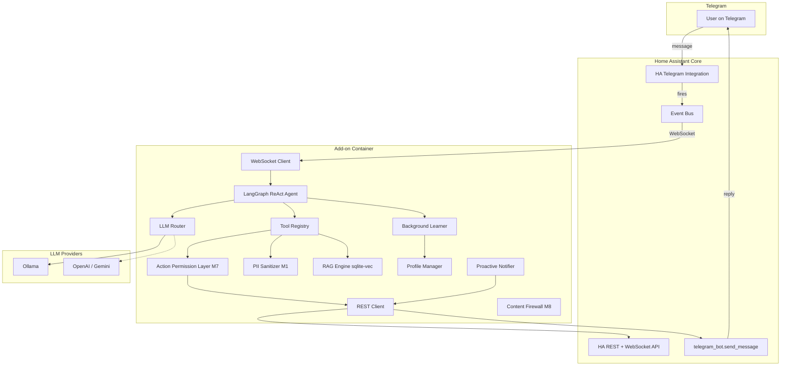

# Architecture

## Overview

The Personal Assistant runs as a **Home Assistant add-on** — an isolated Docker container managed by the HA Supervisor. It communicates with HA Core exclusively via REST API and WebSocket, never touching HA's internal Python runtime.

## System Diagram

## Communication

| Method | Endpoint | Purpose |
|---|---|---|
| REST GET | `/api/states` | Fetch all entity states |
| REST GET | `/api/states/{entity_id}` | Single entity state |
| REST POST | `/api/services/{domain}/{service}` | Call HA services |
| REST GET | `/api/history/period/{start}` | Entity history |
| WebSocket | `subscribe_events` | Real-time event subscription |
| WebSocket | `config/area_registry/list` | Area/device registry |

All authenticated via `SUPERVISOR_TOKEN` (auto-injected by Supervisor).

## Data Flow

1. **User message** → Telegram → HA fires `telegram_text` event
2. **WebSocket** delivers event to add-on container
3. **Context Assembler** builds token-budgeted context (M9)
4. **LangGraph agent** reasons and calls tools
5. **Tools** interact with HA via REST (through Action Permission Layer M7)
6. **Response** sent via `POST /api/services/telegram_bot/send_message`
7. **Learning Worker** processes interaction asynchronously (decoupled)

## Async Execution Model

The add-on runs its own `asyncio` event loop:
- **LangGraph + LangChain**: async-native `ainvoke()` via `aiohttp`
- **SQLite operations**: `aiosqlite` for non-blocking DB access
- **Background tasks**: `asyncio.create_task()` for learner, notifier, RAG reindex
- No risk to HA Core — completely isolated process
